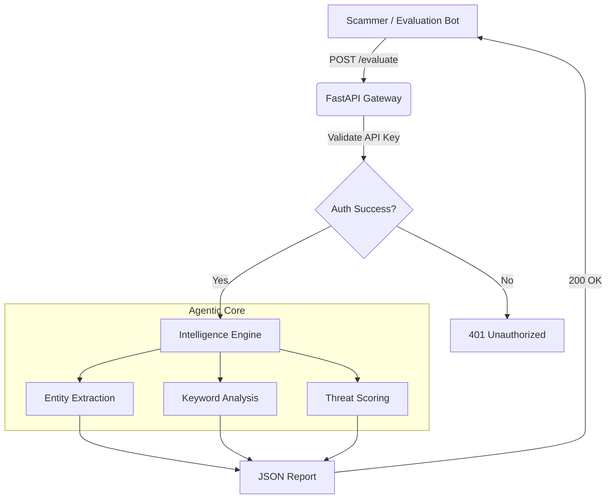

# Agentic Honey-Pot (Scam Protection System)

> **Submission for Problem 2: Agentic Honey-Pot**  
> **Participant:** KannanTech  
> **Event:** India AI Impact Buildathon 2026


## 🛡️ Project Overview

**KannanTech Agentic Honey-Pot** is a high-performance, asynchronous API designed to analyze, detect, and deconstruct digital scam attempts in real-time. Unlike traditional passive blockers, this system uses an **Agentic Intelligence Engine** to parse unstructured text messages (SMS, Email, Social Media DMs) and extract actionable intelligence for security researchers and law enforcement.

### 🎯 The Mission
To act as a "Trap" (Honey-Pot) that validates incoming suspicious messages and identifies:
1.  **Phishing Infrastructure**: Malicious URLs and landing pages.
2.  **Financial Destinations**: Crypto wallet addresses (BTC, ETH, TRON, etc.).
3.  **Social Engineering Tactics**: Urgency detection and psychological manipulation scoring.

---

## ⚡ Key Features

*   **🕵️‍♂️ Intelligent Extraction Engine**:
    *   Uses advanced Regex patterns to identify **Bitcoin, Ethereum, and TRON** wallet addresses.
    *   Extracts obfuscated URLs and potentially malicious links.
    *   Identifies phone numbers and contact details used by scammers.
*   **🧠 Heuristic Scam Classification**:
    *   Automatically categorizes threats into **Crypto Fraud**, **Phishing/Credential Theft**, or **Spam**.
    *   Calculates a **Threat Level** (Low/Medium/High) based on the presence of financial indicators and urgency keywords.
*   **🚀 High-Performance Architecture**:
    *   Built on **FastAPI** for sub-millisecond latency.
    *   Fully asynchronous request handling to support high-concurrency evaluation bots.
*   **🔒 Secure Authentication**:
    *   Protected by `x-api-key` header authentication to prevent unauthorized abuse.

---

## 🏗️ Architecture



---

## 📡 API Documentation

### Endpoint: `POST /evaluate`

Analyzes a text payload and returns extracted intelligence.

**URL**: `https://kind-bobbi-kannantech-5b80eb67.koyeb.app/evaluate`

#### 📥 Request Headers
| Header | Value | Description |
| :--- | :--- | :--- |
| `x-api-key` | `YOUR_SECRET_KEY` | Required for authentication. |
| `Content-Type` | `application/json` | Standard JSON payload. |

#### 📦 Request Body
```json
{
  "message_id": "unique-id-123",
  "content": "URGENT! Your account is compromised. Click https://bit.ly/fake-login and send 0.5 BTC to 1A1zP1eP5QGefi2DMPTfTL5SLmv7DivfNa to secure your funds.",
  "metadata": {
    "source": "sms",
    "timestamp": "2026-02-04T10:00:00Z"
  }
}
```

#### 📤 Success Response (200 OK)
```json
{
  "status": "success",
  "message_id": "unique-id-123",
  "extracted_intelligence": {
    "urls": [
      "https://bit.ly/fake-login"
    ],
    "crypto_addresses": [
      "1A1zP1eP5QGefi2DMPTfTL5SLmv7DivfNa"
    ],
    "phones": [],
    "threat_level": "High",
    "scam_type": "Crypto/Investment Fraud",
    "sentiment": "Urgent/Pressuring"
  }
}
```

---

## 🛠️ Local Installation & Setup

If you wish to run this Agentic Honey-Pot locally for testing or development:

### 1. Clone the Repository
```bash
git clone https://github.com/vkannantech/agentic-honeypot-scam-protection.git
cd agentic-honeypot-scam-protection
```

### 2. Set Up Environment
Create a `.env` file in the root directory:
```env
PARTICIPANT_API_KEY=your_secret_local_key
```

### 3. Install Dependencies
It is recommended to use a virtual environment.
```bash
pip install -r requirements.txt
```

### 4. Run the Server
```bash
python main.py
```
The server will start at `http://0.0.0.0:8000`.

---

## 🧪 Testing

You can test the API using the provided Python script or cURL.

**Using cURL:**
```bash
curl -X POST http://localhost:8000/evaluate \
     -H "x-api-key: your_secret_local_key" \
     -H "Content-Type: application/json" \
     -d '{"content": "Free money! Visit http://scam.com"}'
```

---

## ☁️ Deployment

This project is optimized for cloud deployment on **Render**, **Koyeb**, or **Railway**.

1.  **Push to GitHub**.
2.  **Connect Repo** to your cloud provider.
3.  **Set Environment Variable**: `PARTICIPANT_API_KEY`.
4.  **Deploy**.

---

## 📜 License

This project is open-source and available under the [MIT License](LICENSE).

---

<p align="center">
  Made with ❤️ by <b>KannanTech</b> for a Safer Digital World.
</p>
